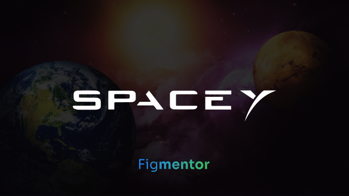
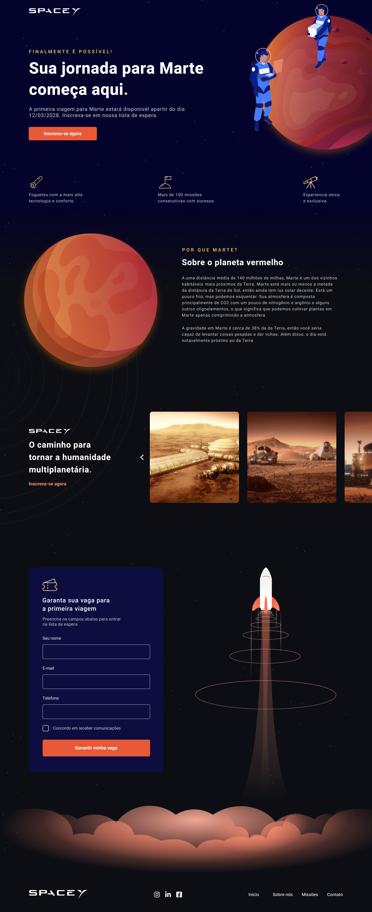

<p align="center">
  
</p>

<!-- <p align="center">
  

  

  
</p> -->

# Desktop

<h1 align="center">
    
</h1>

<br>

# Mobile

<h1 align="center">
    
</h1>

<br>

## 🧪 Tecnologias

Este projeto foi desenvolvido utilizando as seguintes tecnologias:

- [ReactJS](https://reactjs.org/)
- [Styled Components](https://styled-components.com/)
- [Framer Motion](https://framer.com/motion/)

## 🚀 Getting started

Clone o projeto e acesse a pasta.

```bash
git clone
cd
```

Execute este comando para instalar as dependências.

```bash
npm install ou npm i
npm run dev
```

## 🔖 Layout

You can view the project through the links below:

- [Live Preview](#)

- [Figma](https://www.figma.com/community/file/986447430009792279/duplicate)

Remembering that you need to have a [Figma](http://figma.com/) account to access it.

## 📝 License

This project is licensed under the MIT License. See the [LICENSE](LICENSE) file for details.

---

Made with 💜 by [Wellerson Douglas]() 👋
Footer